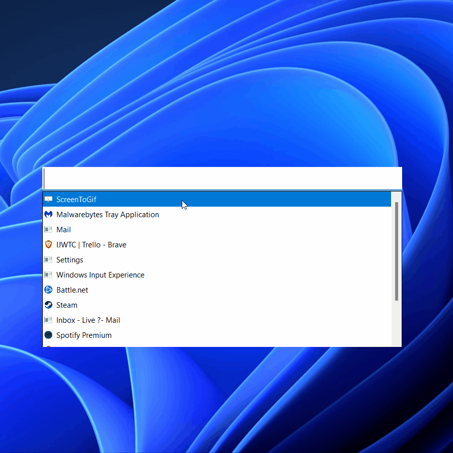

#  Window Finder

⭐ Star us on GitHub if you think this Utility is useful 😊

Effortlessly search for and show any open window on your computer!

### Features:
 - Search Open Windows across all Virtual Desktops!
 - Set global hotkey to bring up search box or use Task Tray Icon
 - Options to customize your experience

### Installation
1. Download from [here]
1. Open installer and follow on-screen steps.
1. The first thing you should do after installation is change the settings to your liking.
1. Thats it!

### How to use:
- Default global hot key to open search is `ALT+F1` (change in options)
- Options shortcut is `CTRL+O` while the search window has focus. Can also access with `/options` when typed in Search box.
- Search will show all open windows 
- Type to filter list
- Use arrow keys or mouse to select a Window
- Use Enter or double click to bring that window into focus
- Press Escape to hide the search window

### Options
Can be opened with `CTRL+O` (while Search has focus) or with `/options`

---
### TODO:
- MAKE OR GET BETTER ICON
- Add ability to pin windows as favorites
    - Will add these to the top of the list everytime
    - Can be turned on/off
- Dark mode

[here]: https://github.com/keagster1/WindowFinder/releases/tag/v1.0.1-beta
